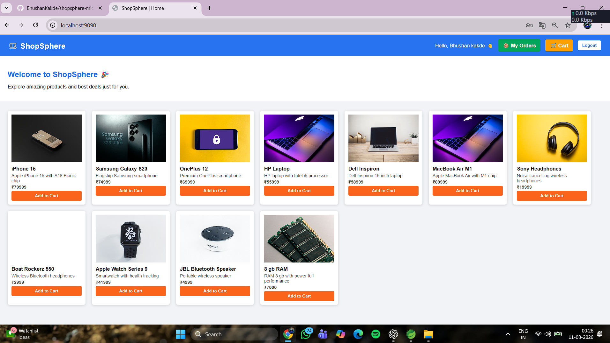
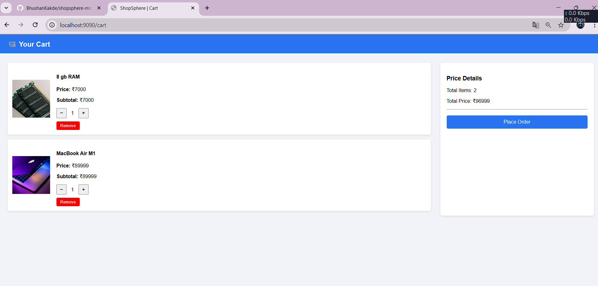
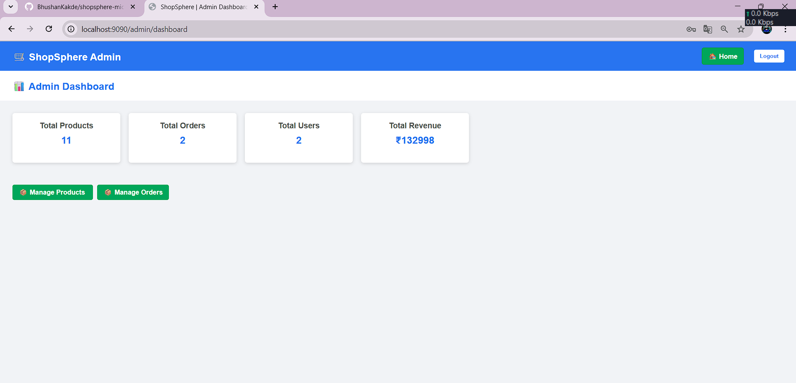
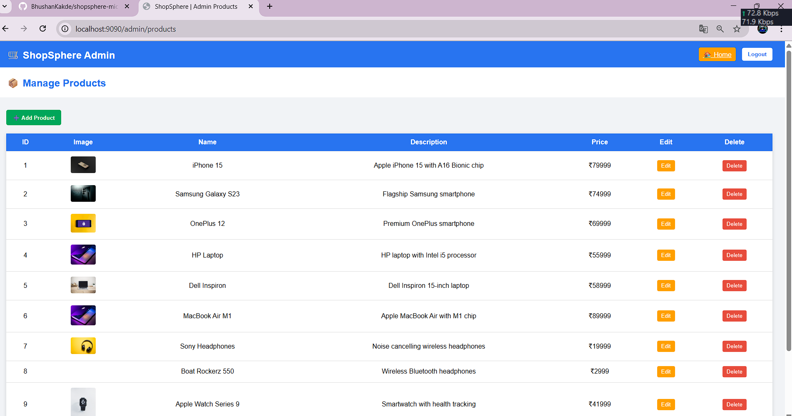
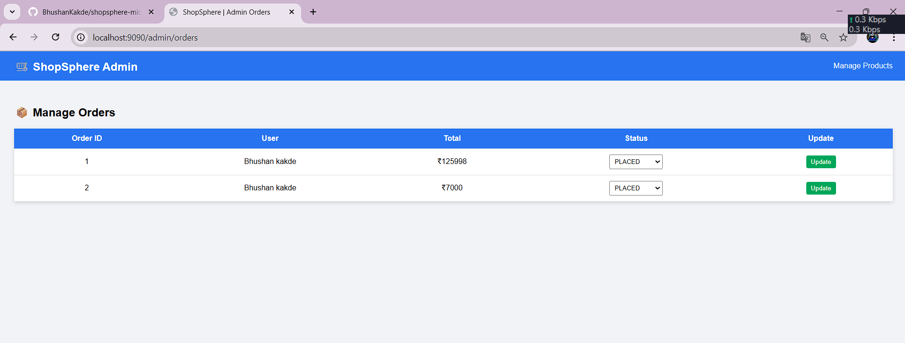
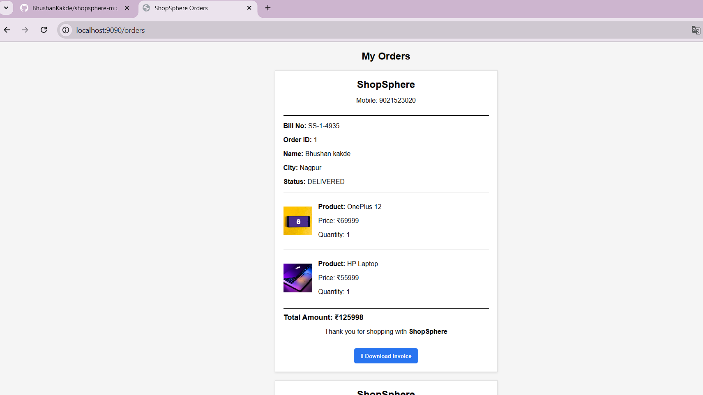

# 🛒 ShopSphere - Microservices E-Commerce System

ShopSphere is a **microservices-based e-commerce platform** built using **Spring Boot and Spring Cloud**.  
It demonstrates a distributed architecture with separate services for users, products, cart, and orders.

---

## 🚀 Tech Stack

### Backend
- Java
- Spring Boot
- Spring Cloud
- Eureka Service Discovery
- REST APIs

### Frontend
- JSP
- HTML
- CSS
- JavaScript

### Database
- MySQL

### Tools
- Spring Tool Suite (STS)
- Git
- GitHub

---

## 🏗 Microservices Architecture

The system consists of multiple services:

- **Eureka Server** → Service discovery
- **API Gateway** → Central entry point
- **User Service** → User management
- **Product Service** → Product catalog
- **Cart Service** → Shopping cart
- **Order Service** → Order processing
- **Frontend App** → User interface

---

## 📂 Project Structure
ShopSphere
│
├── Backend
├── Frontend
├── order-service

---

## ▶️ How to Run the Project

1. Start **Eureka Server**
2. Start **Product Service**
3. Start **User Service**
4. Start **Cart Service**
5. Start **Order Service**
6. Start **Frontend Service**

Then open in browser:
http://localhost:9090

---

## 📸 Screenshots

## Screenshots

## 📸 Screenshots

### 🏠 Home Page

### 🔐 Login Page

### 🛒 Cart Page

### ⚙️ Admin Dashboard

### 📦 Product Add Page

### 📋 Manage Orders

### 🧾 Order History / Bill

---

## ✨ Features

- User registration & login
- Product browsing
- Add to cart
- Place orders
- Admin dashboard
- Microservices communication
- Service discovery using Eureka

---

## 👨‍💻 Author

**Bhushan Kakde**

GitHub: https://github.com/BhushanKakde
